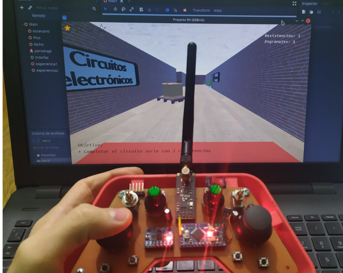
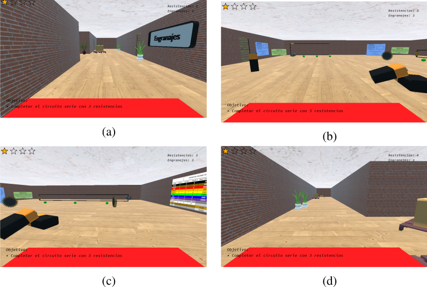

# Proyecto Final Integrador: Entorno virtual de aprendizaje

## Cátedra: Realidad virtual
## Ingeniería en Mecatrónica  
## Facultad de Ingeniería - Universidad Nacional de Cuyo  

---

## Imágenes

---

### Descripción

Este proyecto consiste en el desarrollo de un **Entorno Virtual de Aprendizaje (EVA) en 3D**, orientado a la educación, diseñado para facilitar la comprensión de fenómenos físicos en las áreas de electrónica y mecánica.

Mediante una propuesta didáctica basada en la interacción y el juego, el usuario asume el rol de un personaje que debe recolectar objetos y completar desafíos técnicos, con el objetivo de afianzar conocimientos teóricos de forma práctica.

El entorno fue desarrollado utilizando el motor Godot, el cual permite la creación de aplicaciones interactivas en 2D y 3D mediante una arquitectura basada en nodos y escenas, junto con el uso de lenguajes como GDScript y C++.

---

### Características Principales

- **Experiencias interactivas**
  - Construcción de circuitos eléctricos en serie y paralelo
  - Montaje de trenes de engranajes
  - Visualización de variables físicas como corriente y velocidad

- **Interfaz de hardware propia**
  - Control mediante joystick de fabricación propia
  - Basado en Arduino Pro Mini
  - Comunicación inalámbrica mediante módulos NRF24L01

- **Integración de tecnologías**
  - Sistema multiplataforma que integra hardware y software
  - Flujo de datos compuesto por:
    - Arduino (C++)
    - Python (gestión de comunicación serial)
    - Godot (GDScript)

---

### Tecnologías Utilizadas

- **Motor:** Godot Engine  
- **Lenguajes:**  
  - GDScript (lógica del entorno interactivo)  
  - Python (comunicación serial)  
  - C++ (Arduino)  

- **Hardware:**  
  - Arduino Pro Mini  
  - Transceptores NRF24L01  
  - Componentes electrónicos para la interfaz hombre-máquina (IHM)  
## Proyecto - Entorno Virtual de Aprendizaje (Realidad Virtual)

### Descripción

Este proyecto consiste en el desarrollo de un **Entorno Virtual de Aprendizaje (EVA) en 3D**, orientado a la educación, diseñado para facilitar la comprensión de fenómenos físicos en las áreas de electrónica y mecánica.

Mediante una propuesta didáctica basada en la interacción y el juego, el usuario asume el rol de un personaje que debe recolectar objetos y completar desafíos técnicos, con el objetivo de afianzar conocimientos teóricos de forma práctica.

El entorno fue desarrollado utilizando el motor Godot, el cual permite la creación de aplicaciones interactivas en 2D y 3D mediante una arquitectura basada en nodos y escenas, junto con el uso de lenguajes como GDScript y C++.

---

### Características Principales

- **Experiencias interactivas**
  - Construcción de circuitos eléctricos en serie y paralelo
  - Montaje de trenes de engranajes
  - Visualización de variables físicas como corriente y velocidad

- **Interfaz de hardware propia**
  - Control mediante joystick de fabricación propia
  - Basado en Arduino Pro Mini
  - Comunicación inalámbrica mediante módulos NRF24L01

- **Integración de tecnologías**
  - Sistema multiplataforma que integra hardware y software
  - Flujo de datos compuesto por:
    - Arduino (C++)
    - Python (gestión de comunicación serial)
    - Godot (GDScript)

---

### Tecnologías Utilizadas

- **Motor:** Godot Engine  
- **Lenguajes:**  
  - GDScript (lógica del entorno interactivo)  
  - Python (comunicación serial)  
  - C++ (Arduino)  

- **Hardware:**  
  - Arduino Pro Mini  
  - Transceptores NRF24L01  
  - Componentes electrónicos para la interfaz hombre-máquina (IHM)  

---

### Objetivo del Proyecto

El proyecto busca combinar conceptos de **realidad virtual, interacción humano-máquina y aprendizaje basado en experiencias**, permitiendo al usuario comprender fenómenos físicos a través de la experimentación directa en un entorno virtual.

---

### Resultados

- Entorno 3D interactivo funcional
- Integración efectiva entre hardware físico y entorno virtual
- Mejora en la comprensión de conceptos teóricos mediante simulación

---

### Objetivo del Proyecto

El proyecto busca combinar conceptos de **realidad virtual, interacción humano-máquina y aprendizaje basado en experiencias**, permitiendo al usuario comprender fenómenos físicos a través de la experimentación directa en un entorno virtual.

---

### Resultados

- Entorno 3D interactivo funcional
- Integración efectiva entre hardware físico y entorno virtual
- Mejora en la comprensión de conceptos teóricos mediante simulación
